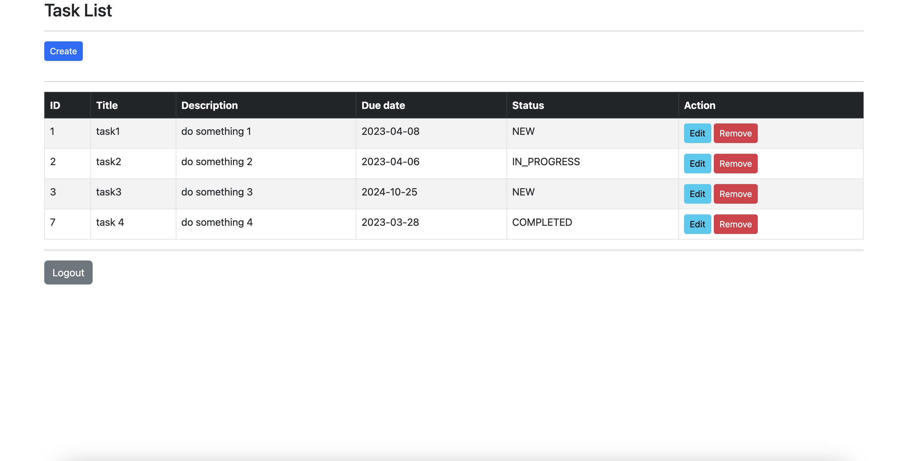
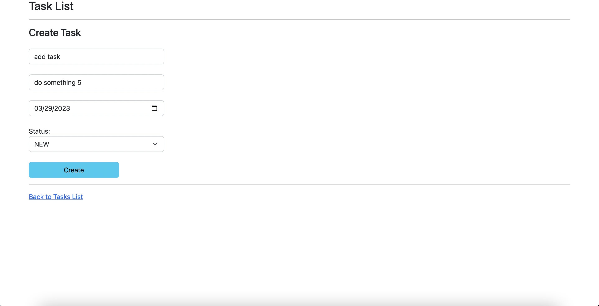
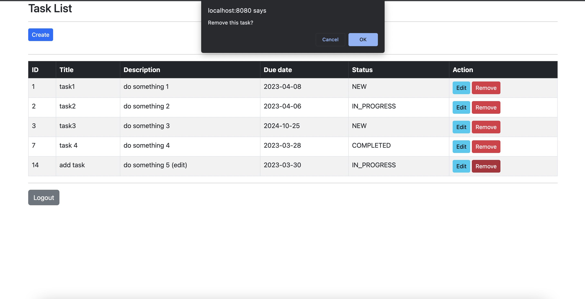
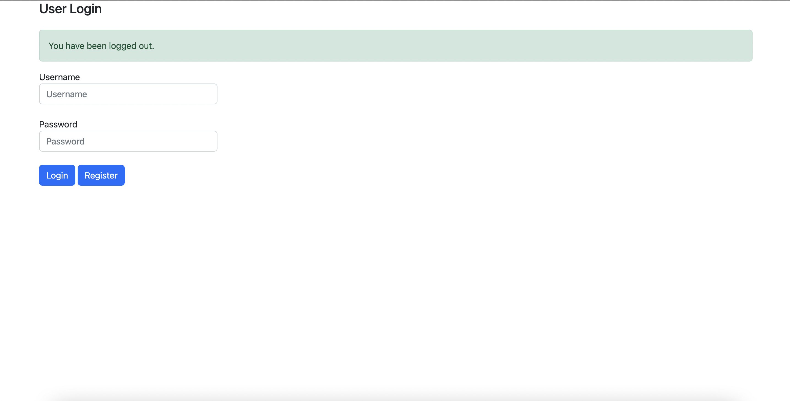
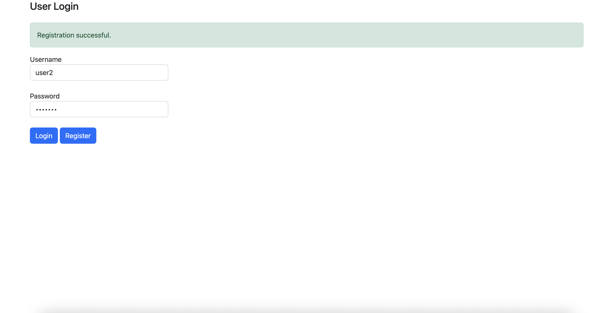

# Todo-List
Spring Boot CRUD web application.

Todo-list application that allows create, edit, delete todo-items to MySql database

Features Spring Security basic authentication that allows user login, and registration.

This project is meant as an excercise project to learn Spring Boot, Rest Api, JPA, JDBC.

Technologies used:

-Spring Boot

-Spring Security

-Spring Hibernate

-MySql database

-Thymeleaf

-BootStrap

=========================================================================================================================================================
Login Page:

Uses Spring Security basic authentication. Read users stored from database.

=========================================================================================================================================================

Display todo list of current user.

=========================================================================================================================================================

Form to input a task and store in database.

=========================================================================================================================================================

Remove an item from the list.

=========================================================================================================================================================

Log out user.

=========================================================================================================================================================

Registration form to add a new user to the database.

=========================================================================================================================================================

Registration success.

=========================================================================================================================================================

